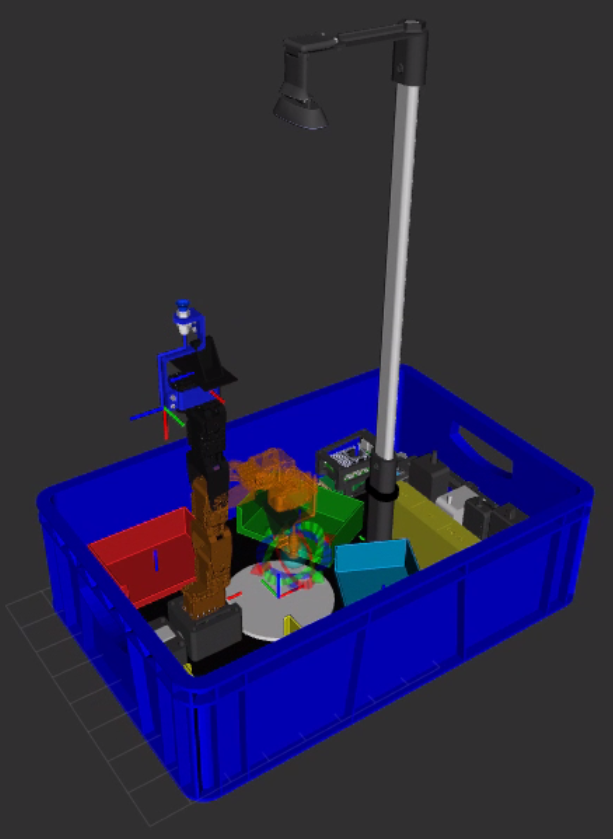

# KIT PHANTOM X PINCHER

**Autor:** Johan Alejandro López Arias ([@ElJoho](https://github.com/ElJoho))

**Director:** Pedro Fabián Cárdenas Herrera 

---
## EN CASO DE EMERGENCIA

Si han dañado el sistema operativo de la raspberry pi instalando algo, pueden reestablecer el sistema con ubuntu 24.04 y todo instalado y configurado (nomachine,ros2, opencv, etc) siguiendo el tutorial del repositorio ([UNPi5_Image_Ubuntu24_04](https://github.com/labsir-un/UNPi5_Image_Ubuntu24_04.git))

  

    <b>Video tutorial</b> — <a href="https://www.youtube.com/watch?v=L0ZhnwBIGkc">Reestablecer sistema de raspberry pi 5 usando el backup</a>
  

 

## Iniciando

### Introduccion al Kit fisico

Se recomienda ver los siguientes videos introductorios al kit fisico:

  

    <b>Video tutorial</b> — <a href="https://www.youtube.com/watch?v=fg1AXdiOE6Y">Introducción al Kit fisico del robot</a>
  

 

  

    <b>Video tutorial</b> — <a href="https://www.youtube.com/watch?v=txS73u_q9bY">Como organizar el Kit en su contenedor</a>
  

 

### Conexión con Raspberry Pi para ver pantalla

Para observar la pantalla de la Raspberry Pi necesita realizar una conexión usando un cable ethernet y un programa conocido como NoMachine. El proceso de cómo hacerlo puede verlo en la guía en el siguiente enlace:

[Guia: Conexión NoMachine](guias/Setup/conexionNoMachine.md)

  

    <b>Video tutorial</b> — <a href="https://www.youtube.com/watch?v=30KEEl1uhBM">Como conectarse a las raspberry pi usando NoMachine</a>
  

 

### Probar el funcionamiento del robot usando Dynamixel Wizard 2.0

Para probar el funcionamiento del robot se puede usar el programa Dynamixel Wizard que ya viene instalado en la raspberry pi. No se cuenta con una guia pero si con un video mostrando el funcionamiento del programa y como se prueba el robot con Dynamixel Wizard 2.0

  

    <b>Video tutorial</b> — <a href="https://www.youtube.com/watch?v=VNw8zVJwRWo" >Como usar Dynamixel Wizard 2.0</a>
  

 

### Conexión SFTP en VS Code (Recomendado)

Es posible usar Visual Studio Code para editar y subir archivos a la Raspberry Pi usando una extensión de SSH. El proceso para realizar esto se encuentra en la siguiente guía:

[Guia: Edición remota con la extensión SFTP de VS Code](guias/Setup/sftp_vscode.md)

  

    <b>Video tutorial</b> — <a href="https://www.youtube.com/watch?v=CL0vpqbWdjM">Como usar visual studio code SFTP para conectarse a raspberry pi</a>
  

 

> **Importante:** Este NO consume RAM de las raspberry pi
> PERO requiere sincronizar constantemente la carpeta de windows
> con la carpeta de la raspberry pi.

### Conexion usando Samba

La conexión mediante Samba permite acceder a los archivos de la Raspberry Pi desde Windows como si fueran una carpeta compartida en red. Esto facilita editarlos con IDEs de Windows, así como copiar, pegar o arrastrar archivos directamente. Aunque requiere instalar Samba en la Raspberry y configurarlo en Windows, una vez listo resulta muy cómodo, especialmente para proyectos grandes.

[Guia: Configuración Samba en Raspberry pi y windows](guias/Setup/guiaSamba.md)

  

    <b>Video tutorial</b> — <a href="https://www.youtube.com/watch?v=cnAaOMN6Adk">Como usar Samba para conectarse a raspberry pi</a>
  

 

> **Importante:** Este NO consume RAM de las raspberry pi
> PERO requiere de reconectar constantemente las raspberry 
> y windows por medio del uso de windows powershell cada vez
> que se conecta la raspberry al PC al usar el comando en 
> windows powershell (NO ejecutar como administrador):
> net use Z: \\192.168.10.2\unpi /user:unpi unpi /persistent:nes

### Conexión SSH en VS Code

Es posible usar Visual Studio Code para editar y subir archivos a la Raspberry Pi usando una extensión de SSH. El proceso para realizar esto se encuentra en la siguiente guía:

[Guia: Configuración SSH en VS Code](guias/Setup/sshVScode.md)

  

    <b>Video tutorial</b> — <a href="https://www.youtube.com/watch?v=30KEEl1uhBM">Como conectarse a las raspberry pi usando NoMachine</a>
  

 

> **Importante:** Este metodo consume RAM de las raspberry pi
> pero permite modificar los archivos directamente.

---

## Setup

Para observar la guía de cómo hacer la instalación de ROS2 en Ubuntu 24.04 LTS puede dirigirse al siguiente archivo:

[Guia: Setup de ROS2](guias/Setup/readme.md)

---
## URDF y RVIZ

### Añadiendo elementos al robot

En la siguiente guia se encuentra una serie de pasos para añadir elementos xacro al robot para su visualizaci´on en rviz. Adicionalmente hay una serie de 10 videos explicando las distintas maneras en que se pueden añadir elementos para modificar la plataforma del robot o al brazo robotico. Adicionalmente se explica como usar la ventosa en el video final.

[Guia: Añadir elementos xacro al robot](guias/URDF/addingXacroElements.md)

  

    <b>Video tutorial. Ep. 1</b> — <a href="https://www.youtube.com/watch?v=12hgfwh_EL4">Introducción a URDF</a>
  

 

  
<b>Ep. 10</b> — <a href="https://www.youtube.com/watch?v=GsfinJpJwyY">Cambiar posición del TCP</a>

> **Importante:** Para cambiar el TCP a suction puede usar la
> variable `use_suction_cup:=true` con el paquete bringup usando el
> siguiente comando:

> `ros2 launch phantomx_pincher_bringup phantomx_pincher.launch.py use_suction_cup:=true`

---

## MoveIt

### Como mover el robot

Para mover el robot puede leer la guia o ver el video que se muestran a continuacion:

[Guia: Comandos de Movimiento](guias/Moveit/MOTION_COMMANDS.md)

  

    <b>Video tutorial</b> — <a href="https://www.youtube.com/watch?v=CDmSgoLtIdU">Como mover el robot (Mottion commands)</a>
  

 

### Calibración del gripper

[Guia: Calibración del gripper](guias/Setup/guia_calibracion_gripper.md)

---

## APRENDE ROS2

Se recomienda ver el [indice sobre las guias de ros2_basics](guias/ROS2_basics/README.md) el cual cuenta con enlaces a las guias disponibles asi como menciona videos tutoriales que pueden ver.

A continuacion se listan las guias disponibles:

1. [Guía:  Parte 1 — Publishers y subscribers](guias/ROS2_basics/ros2_basics_part1_publisher_and_subscriber.md)

2. [Guía: Parte 2 — Mover el robot](guias/ROS2_basics/ros2_basics_part2_moving_the_robot.md)

---

## REPOSITORIOS RELACIONADOS

### Repositorio con todos los modelos 3D usados en el desarrollo del kit

[3DModels_KIT_Phantom_Pincher_X100](https://github.com/labsir-un/3DModels_KIT_Phantom_Pincher_X100.git)

### Repositorio con el back up del sistema operativo de la raspberry pi 5

[UNPi5_Image_Ubuntu24_04](https://github.com/labsir-un/UNPi5_Image_Ubuntu24_04.git)

---

## Como hacer un Back up

Si el profesor, monitor o estudiantes fuesen a añadir o modificar el sistema operativo, es posible que necesiten hacer un back up del mismo. La siguiente guia y tutorial.

[Crear un backup del sistema de la Raspberry Pi 5 con Disks (Ubuntu 24.04)](guias/Setup/backupRaspberryPi.md)

  

    <b>Video tutorial</b> — <a href="https://www.youtube.com/watch?v=gqHvcgRHNKI"> Crear Backup del sistema de raspberry pi 5 usando Disks en Ubuntu 24.04</a>
  

 